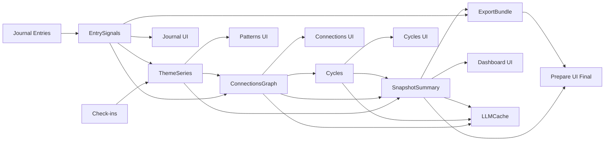

# Derived Data Spec (MindStorm Patient Insights)

> Single source of truth for how raw user inputs become reusable derived “insight primitives.”
> This document exists to prevent redundant computation, reduce LLM timeouts, and keep every UI page reading from the same cached derived layer.

---

## Goals

* **Compute once, reuse everywhere.** No page should re-derive the same meaning.
* **Pages never block on LLM calls.** LLM outputs are cached and optional.
* **Raw text is not repeatedly scanned.** We derive `EntrySignals` once per entry and reference evidence via pointers.
* **Materialized views are versioned.** Derived objects carry `pipelineVersion`, `computedAt`, and `sourceVersion`.
* **Uncertainty is preserved.** Absence of mention ≠ absence of experience.

---

## Terminology

### Raw sources

* **Journal Entry**: free text written by the user (timestamped)
* **Check-in**: structured quick metrics (timestamped)

### Derived primitives

* **EntrySignals**: per-entry extracted themes + evidence + attributes
* **ThemeSeries**: per-theme daily/weekly time series aggregates
* **ConnectionsGraph**: relationships between themes (co-occur, lead/lag)
* **Cycles**: frequent sequences (A → B → C)
* **SnapshotSummary**: cached “current snapshot” used on Dashboard / Prepare seed
* **ExportBundle**: immutable snapshot assembled for sharing/export
* **LLMCache**: cached natural-language wording for edges/cycles/snapshots (never used to compute stats)

---

## Range Keys (Standard)

All range-dependent derived objects must include `rangeKey`.

* `last_7d`
* `last_30d`
* `last_90d`
* `all_time`
* `custom_YYYY-MM-DD_YYYY-MM-DD`

**Rule:** Every API that returns derived objects must accept `rangeKey` (default `last_30d`).

---

## Versions & Freshness

Every derived object must include:

* `computedAt: ISODate`
* `pipelineVersion: string` (bump when logic changes)
* `sourceVersion: string` (hash of latest entry/check-in update timestamp within range)
* `stale: boolean` (true if invalidated and awaiting recompute)

**Rule:** UI may render stale objects with an “Updating…” note, but must never block.

---

## Evidence Pointer Conventions

Evidence is always stored or referenced in a reusable way.

* `EntrySignals` store `spans[]` with `spanId`, `entryId`, `start`, `end`, `text`, `themeId`, `confidence`
* `ConnectionsGraph.edges[]` store `evidenceEntryIds[]` and optionally `evidenceSpanIds[]`
* `Cycles` store `evidenceEntryIds[]`
* `SnapshotSummary` stores references (`topThemeIds[]`, `topEdgeIds[]`, `topCycleIds[]`) rather than raw text
* `ExportBundle` stores selected `quoteIds` / `spanIds` plus redactions

**Rule:** No page re-scans all raw entries to “find evidence.” Pages request evidence via pointers.

---

## Derived Data DAG

---

## Edge Specs (Derived Data Contract)

Each row specifies **when** an edge runs, **how expensive** it is, **how** it is cached, and whether it includes **evidence pointers**.

### Trigger types

* `on_save(entry)`
* `on_save(checkin)`
* `debounced(stale_user_range)`
* `nightly`
* `on_demand(view)`
* `on_demand(export)`

### Compute cost

* `low`: <200ms
* `med`: <2s
* `high`: seconds–minutes

| Edge                               | Trigger                     | Compute Cost | Cache Policy                       | Evidence Pointers |
| ---------------------------------- | --------------------------- | ------------ | ---------------------------------- | ----------------- |
| Journal Entries → EntrySignals     | on_save(entry)              | low-med      | per-entry immutable unless edited  | YES (spans)       |
| Check-ins → ThemeSeries            | on_save(checkin)            | low          | incremental upsert per bucket      | NO                |
| EntrySignals → ThemeSeries         | on_save(entry)              | low-med      | incremental upsert per bucket      | NO                |
| EntrySignals → ConnectionsGraph    | debounced(stale_user_range) | med          | materialize per (userId, rangeKey) | YES               |
| ThemeSeries → ConnectionsGraph     | debounced(stale_user_range) | med          | materialize per (userId, rangeKey) | NO                |
| ConnectionsGraph → Cycles          | nightly / on_demand         | high         | materialize per (userId, rangeKey) | YES               |
| ThemeSeries → SnapshotSummary      | debounced(stale_user_range) | low-med      | materialize per (userId, rangeKey) | NO                |
| ConnectionsGraph → SnapshotSummary | debounced(stale_user_range) | low          | materialize per (userId, rangeKey) | YES               |
| Cycles → SnapshotSummary           | nightly                     | low          | include top 0–1 cycles             | YES               |
| EntrySignals → ExportBundle        | on_demand(export)           | low-med      | immutable snapshot                 | YES               |
| SnapshotSummary → ExportBundle     | on_demand(export)           | low          | immutable snapshot                 | NO                |
| ConnectionsGraph → LLMCache        | on_demand(view)             | low          | hash-keyed cache                   | YES               |
| Cycles → LLMCache                  | on_demand(view)             | low          | hash-keyed cache                   | YES               |
| SnapshotSummary → LLMCache         | debounced / on_demand       | low          | hash-keyed cache                   | NO                |

---

## Invalidation Rules

### Journal entry created or edited

* Recompute `EntrySignals(entryId)`
* Incrementally update `ThemeSeries` buckets
* Mark `ConnectionsGraph` and `SnapshotSummary` (relevant ranges) as stale

### Check-in created or edited

* Incrementally update `ThemeSeries` buckets
* Mark `SnapshotSummary` as stale

### Nightly

* Recompute `Cycles(last_90d)`
* Optionally refresh long-range `ConnectionsGraph` and `SnapshotSummary`

---

## Storage Model (MongoDB)

### Raw

* `entries`
* `checkins`

### Derived

* `entry_signals`
* `theme_series_points`
* `connections_graph`
* `cycles`
* `snapshots`
* `exports`

### Language cache

* `llm_generations`

---

## UI Read Rules

* **Journal UI** → `entries` + `entry_signals(entryId)`
* **Patterns UI** → `theme_series_points` + evidence via pointers
* **Connections UI** → `connections_graph` + evidence via pointers
* **Cycles UI** → `cycles` + evidence + time overlay
* **Dashboard UI** → `snapshots(last_30d)`
* **Prepare UI** → `snapshots` seed → `exports` after creation

**Absolute rule:** No UI route triggers LLM calls synchronously.

---

## Acceptance Criteria

* No page rescans raw entries for insights.
* Dashboard loads from a single snapshot document.
* Connections and Cycles pages use materialized graphs.
* Evidence shown via pointers, not text scans.
* LLM calls are cached, optional, and never block UI.
* Invalidation rules prevent contradictory states across pages.
