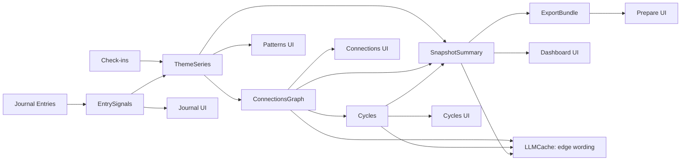

# Derived Data Architecture

This doc describes the "derived layer" that powers patient-facing pages without recomputing on demand.
Pages read from derived collections and never call LLMs directly.

## Design Goals

- Fast page loads with no on-demand recomputation.
- Event-driven, debounced recompute after entry saves.
- Reproducible outputs with versioning + stale flags.
- LLM used only for wording, cached by stable keys.

## Page × Primitive Matrix

Page | EntrySignals | ThemeSeries | ConnectionsGraph | Cycles | SnapshotSummary | ExportBundle | LLMCache
--- | --- | --- | --- | --- | --- | --- | ---
Dashboard |  | ✅ | ✅ (top edges) |  | ✅ |  | ✅
Journal Entry | ✅ |  |  |  |  |  |
Patterns | ✅ (evidence) | ✅ |  |  | ✅ (theme summary) |  | ✅
Connections | ✅ (evidence) |  | ✅ |  |  |  | ✅ (edge wording)
Cycles | ✅ (evidence) | ✅ | ✅ | ✅ |  |  | ✅ (cycle wording)
Prepare |  |  | ✅ | ✅ | ✅ (bullets/questions) | ✅ | ✅

## Derived Collections

### entry_signals (P1)
Computed per entry. Atomic building blocks.
- themes + spans + attributes (time mentions, life areas, influences)
- evidence snippets
- timestamps

### theme_series (P2)
Aggregated time series per theme.
- daily/weekly points per theme (presence/intensity/confidence)

### connections_graph (P3)
Co-occurrence + temporal edges.
- nodes + edges + evidence entry ids

### cycles (P4)
Repeated sequences.
- sequences like Sleep↓ → Energy↓ → Withdrawal↑
- evidence entry ids

### snapshots (P5)
Latest “current snapshot.”
- top patterns, top connections, influences, questions

### llm_generations
Wording-only generations.
- cached by stable hash, regenerated only when primitives change

## Data Freshness

All derived docs include:
- userId
- rangeKey (e.g., last_30_days, custom_2026-01-01_2026-01-14)
- computedAt
- pipelineVersion
- sourceVersion (e.g., last entry updated timestamp)
- stale: boolean

## Event-Driven Recompute

On every entry save:
1) write entry
2) compute EntrySignals for that entry
3) mark derived docs as stale
4) enqueue recompute job (debounced)

Pages:
- prefer latest non-stale
- if stale, render last stale + “Updating…” status

## Mermaid Flow

